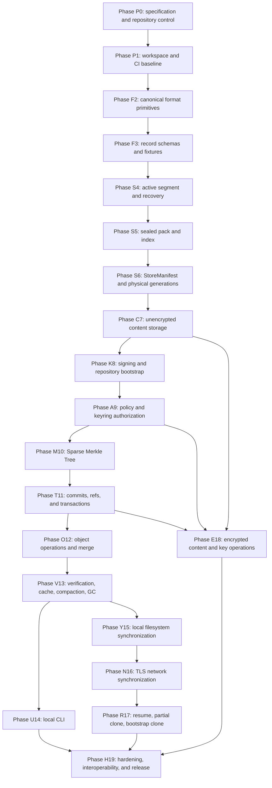

# EternalCore v4 Implementation Plan

> Status: execution baseline
>
> This document defines the only approved implementation order, task boundaries, dependency graph, and red/green gates for EternalCore v4. It does not redefine storage, transaction, cryptographic, authorization, or synchronization semantics. Those semantics remain authoritative in the referenced specifications.

## 1. Authority and scope

### 1.1 Document precedence

When implementing a task, use the following precedence:

1. `docs/FORMAT.md` for bytes, schemas, identifiers, limits, parser behavior, record types, segment, pack, index, pointer files, and fixtures.
2. `docs/TRANSACTIONS.md` for locking, fsync, rename, crash recovery, snapshots, publication, ambiguity, sealing, compaction, and GC transaction order.
3. `docs/CRYPTO.md` for algorithms, key hierarchy, signatures, slots, nonces, AAD, secret handling, key rotation, and cryptographic audit.
4. `docs/POLICY.md` for trust bootstrap, policy chain, roles, ref permissions, revocation, commit authorization, and remote acceptance.
5. `docs/SYNC.md` for transport, wire protocol, snapshots, graph negotiation, quarantine, transfer, push, pull, partial clone, and bootstrap clone.
6. `docs/ARCHITECTURE.md` for system boundaries, crate ownership, public behavior, non-goals, and architecture-wide invariants.
7. `docs/PLAN.md` for order, task boundaries, required evidence, and stop conditions.

If two semantic specifications conflict, the Agent MUST stop. It MUST NOT choose one interpretation, average the two, introduce a compatibility mode, or silently alter either document. The conflict is a specification defect and requires an explicit specification amendment before implementation continues.

### 1.2 What this plan controls

This plan controls:

- the order in which implementation paths become available;
- the exact output expected from each task;
- the files or crates a task may modify;
- the tests that must exist before a task is green;
- phase-level hard gates;
- when integration, optimization, networking, encryption, and release work may begin.

This plan does not authorize:

- redesigning any format or protocol;
- replacing a mandated algorithm;
- adding compatibility with obsolete drafts;
- adding optional implementations before the baseline implementation is complete;
- opening multiple large implementation fronts in parallel;
- marking a task complete by subjective assessment.

## 2. Agent execution contract

### 2.1 One active task

The Agent MUST work on exactly one numbered task at a time.

A task is active only when all of its declared dependencies are green. The Agent MUST NOT implement code belonging to a later task “because it is nearby,” “to make the design cleaner,” or “to avoid revisiting the file.”

Permitted preparatory work is limited to:

- adding the exact type or trait stub required by the active task;
- adding tests required by the active task;
- making a minimal compile-preserving change in a dependency crate.

Any broader work is out of scope.

### 2.2 Objective status model

Every task begins **RED**.

A task becomes **GREEN** only when all of the following are true:

1. every required deliverable exists;
2. every required test exists and tests behavior rather than only construction;
3. every command listed in the task exits with status 0;
4. the task-specific negative test fails before implementation or demonstrably exercises the rejected path;
5. no forbidden file or crate was modified;
6. no `TODO`, `FIXME`, `todo!`, `unimplemented!`, placeholder success path, disabled assertion, ignored required test, or silent fallback remains in the task output;
7. the phase-wide static checks applicable at that point pass;
8. the commit contains only the active task and unavoidable compile-preserving edits.

A task remains **RED** when any criterion is missing, even when the Agent believes the implementation is “mostly complete.”

`BLOCKED` may be used only when an external prerequisite is unavailable or the specifications conflict. `BLOCKED` is not a pass state and does not open downstream tasks.

### 2.3 Stop-on-red rule

At the first failing gate, the Agent MUST:

1. stop opening new implementation paths;
2. preserve the exact failing command and the first relevant error;
3. identify the smallest violated invariant;
4. repair only the current task or an already-green dependency proven defective;
5. rerun the current task gate;
6. rerun every affected upstream phase gate.

The Agent MUST NOT compensate for a red gate by weakening the test, widening accepted input, skipping a checksum, reducing a durability step, changing a mandated algorithm, or marking the test ignored.

### 2.4 No self-approved specification changes

The Agent may correct spelling, links, and non-semantic examples. It MUST NOT change normative behavior in any specification without a dedicated specification-amendment task authorized outside this plan.

A proposed semantic change must state:

- the exact conflicting sections;
- the invariant that cannot be implemented;
- the proposed single replacement rule;
- affected fixtures and compatibility consequences;
- which completed gates must be reopened.

Until accepted, implementation follows the current documents.

### 2.5 Commit discipline

Each task produces one reviewable commit after it turns green.

Commit title format:

```text
<task-id>: <imperative summary>
```

Examples:

```text
F2.3: implement bounded deterministic CBOR decoding
S4.5: validate TransactionEnd batches during recovery
L8.4: publish refs through predecessor-linked CAS
```

The Agent MUST NOT combine two numbered tasks into one commit. A task may use multiple local work-in-progress commits, but the submitted history must expose one final task-scoped commit or a clearly squashed equivalent.

### 2.6 Required task report

For each completed task, report only:

```text
Task:
Changed:
Tests added:
Gate commands:
Result:
Residual risks: none | exact bounded item
```

Do not restate the architecture or propose unrelated follow-up work.

## 3. Fixed engineering choices

The following choices are closed for v4 baseline implementation.

### 3.1 Workspace dependency direction

```text
eternal-format
    ↑          ↑
eternal-store  eternal-crypto
    ↑          ↑
       eternal-core
             ↑
        eternal-net
             ↑
        eternal-cli
```

Normative dependency rules:

- `eternal-format` depends on no EternalCore crate.
- `eternal-store` depends on `eternal-format`, never on `eternal-core`, `eternal-net`, or `eternal-cli`.
- `eternal-crypto` depends on `eternal-format`, never on storage, core, network, or CLI.
- `eternal-core` owns logical semantics and may depend on format, store, and crypto.
- `eternal-net` may depend on format and core; it never updates refs or StoreManifest files directly.
- `eternal-cli` contains no authoritative logic and delegates to core or net APIs.
- Cyclic crate dependencies are forbidden.

### 3.2 Approved implementation path

Use the following baseline:

- Rust stable, edition 2024.
- Custom bounded RFC 8949 deterministic CBOR encoder and decoder in `eternal-format`; generic Serde CBOR output is not authoritative.
- SHA-256 through `sha2`.
- HMAC-SHA-256 through `hmac`.
- CRC-32C through a hardware-accelerated safe crate with a test against `FORMAT.md` vectors.
- Ed25519 through `ed25519-dalek` strict verification APIs.
- X25519 through `x25519-dalek`.
- HKDF-SHA-256 through `hkdf`.
- Argon2id through `argon2`.
- XChaCha20-Poly1305 through the high-level `chacha20poly1305` AEAD API.
- Secret cleanup through `zeroize` and secret-bearing wrapper types.
- Zstandard through `zstd`; no gzip path.
- `redb` only as a rebuildable cache.
- Safe cross-platform advisory locking; no PID-age lock breaking.
- TLS 1.3 through `rustls` and `tokio-rustls`.
- Async runtime through `tokio`.
- Dynamic async remote interfaces through `async-trait` until a stable object-safe replacement is adopted by an explicit plan amendment.
- No memory-mapped authoritative parser in v4 baseline.
- No asynchronous background sealing in the initial implementation; sealing is synchronous and transactionally published.
- No automatic merge, force update, last-writer-wins, or conflict branch creation.

Dependency versions must be pinned by `Cargo.lock`. Replacing any listed primitive or adding an algorithm alternative requires a specification amendment.

### 3.3 Code quality baseline

All workspace crates MUST enable:

```rust
#![forbid(unsafe_code)]
```

Library code MUST NOT use:

- `unwrap()`;
- `expect()`;
- `panic!()` for recoverable input or I/O errors;
- unchecked integer arithmetic on untrusted lengths or offsets;
- unbounded recursion or allocation from decoded input;
- stringly typed protocol or format errors.

Tests may use `unwrap()` and `expect()` locally.

The workspace lint policy MUST deny at least:

```text
warnings
clippy::unwrap_used
clippy::expect_used
clippy::panic
```

A narrowly justified lint exception must be local to one item and include a reason.

## 4. Gate system

### 4.1 Standard task gate

Unless a task states otherwise, its green gate includes:

```bash
cargo fmt --all -- --check
cargo check --workspace --all-targets --all-features
cargo clippy --workspace --all-targets --all-features -- -D warnings
cargo test --workspace --all-features
cargo test --doc --workspace --all-features
```

Early tasks may run a narrower crate test during iteration, but no task is green until the currently buildable workspace passes.

### 4.2 Hard phase gate

A hard phase gate is cumulative. It reruns all tests from the current and earlier phases that can be affected.

A later phase MUST NOT begin until the previous hard gate is green in CI on Linux. Cross-platform gates become mandatory at the phases explicitly listed below.

### 4.3 Evidence

Each hard gate must produce machine-readable CI artifacts containing:

- commit hash;
- Rust toolchain version;
- operating system and architecture;
- commands executed;
- exit status;
- test counts;
- ignored test list;
- fixture checksum list where applicable;
- failpoint matrix summary where applicable.

Required tests may not be ignored. Expensive tests may be split into a scheduled job only after an equivalent bounded test remains in the pull-request gate.

### 4.4 Red conditions common to all phases

The phase is red when any of the following is observed:

- format bytes differ from a normative fixture;
- a parser accepts non-canonical authoritative encoding;
- a ref can resolve to an incomplete immutable graph;
- a recovery path guesses between histories;
- an index or cache becomes authoritative;
- a signature is accepted without policy authorization where authorization is required;
- a revoked key is evaluated by timestamp rather than commit ancestry;
- a network import bypasses quarantine or core validation;
- a partial clone omits mandatory metadata closure;
- encryption changes logical content or repository state identifiers;
- a crash failpoint exposes partial pointer bytes;
- a task introduces an undocumented alternative algorithm or fallback.

## 5. Roadmap graph



Critical path:

```text
P0 → P1 → F2 → F3 → S4 → S5 → S6 → C7 → K8 → A9
→ M10 → T11 → O12 → V13 → Y15 → N16 → R17 → H19
```

Encryption opens only after content, authorization, and transaction semantics are stable. It may proceed after T11, but final release remains blocked until both E18 and R17 are green.

## 6. Phase P0 — Specification and repository control

**Purpose:** establish one repository layout, one normative document set, one fixture location, and one task-control mechanism before implementation.

**Allowed scope:** repository root, `docs/`, `tests/vectors/`, CI configuration, non-code scripts.

### P0.1 Install the authoritative document set

**Deliverable**

- Place the six specifications and this plan under `docs/`:
  - `ARCHITECTURE.md`
  - `FORMAT.md`
  - `TRANSACTIONS.md`
  - `CRYPTO.md`
  - `POLICY.md`
  - `SYNC.md`
  - `PLAN.md`
- Remove obsolete implementation copies from other documentation paths or mark them clearly non-authoritative outside the build inputs.

**Green**

- Exactly one authoritative copy of each document exists under `docs/`.
- Every internal reference resolves to a real file.

**Red**

- Multiple documents claim to be the current architecture or format.
- Old drafts remain discoverable as implementation instructions.

### P0.2 Install format fixtures

**Deliverable**

- Extract `EternalCore-format-v1-fixtures.zip` into `tests/vectors/format-v1/`.
- Add a fixture manifest containing filename, byte length, and SHA-256.

**Green**

- Fixture manifest verification script exits 0.
- No fixture is generated dynamically during the test that is supposed to validate it.

**Red**

- Expected bytes are computed by the same implementation under test.

### P0.3 Create specification reference checks

**Deliverable**

- Add `scripts/check-specs` that verifies required document names, required major headings, fixture paths, and absence of known obsolete terms listed in the specifications.

**Green**

```bash
scripts/check-specs
```

exits 0.

**Red**

- The script edits documents or resolves conflicts automatically.

### P0.4 Create the task ledger

**Deliverable**

- Add a machine-readable task ledger containing every task ID in this plan and one of `RED`, `GREEN`, or `BLOCKED`.
- Default every implementation task to `RED`.
- Record dependency task IDs.

**Green**

- A validation script rejects opening a task whose dependencies are not green.

**Red**

- The Agent can set a phase green without all child tasks being green.

### P0.5 Freeze Phase 0

**Hard Gate G0**

```bash
scripts/check-specs
scripts/check-fixtures tests/vectors/format-v1/manifest.json
scripts/check-plan-ledger
```

**G0 is green only when:**

- all documents are installed;
- fixture checksums match;
- no unresolved specification conflict is recorded;
- the ledger contains every plan task.

No Rust code may be merged before G0.

## 7. Phase P1 — Workspace and CI baseline

**Purpose:** create a compiling empty workspace with enforced boundaries and objective CI.

**Allowed scope:** root Cargo files, crate manifests, crate roots, CI, test support.

### P1.1 Create the workspace skeleton

Create exactly these crates:

```text
crates/eternal-format
crates/eternal-store
crates/eternal-crypto
crates/eternal-core
crates/eternal-net
crates/eternal-cli
```

Each crate must compile with an empty public surface and `#![forbid(unsafe_code)]`.

**Green**

```bash
cargo check --workspace
```

**Red**

- Additional production crates are introduced without a plan amendment.
- A cyclic dependency is required to compile.

### P1.2 Enforce dependency direction

**Deliverable**

- Add a dependency graph check in CI.
- Encode the permitted EternalCore crate edges from section 3.1.

**Green**

- The check fails on a test branch containing a forbidden edge.

### P1.3 Establish lint and formatting policy

**Deliverable**

- Workspace lint configuration.
- `rustfmt` configuration.
- Deny warnings in CI.
- Deny unsafe code in every crate.

**Green**

```bash
cargo fmt --all -- --check
cargo clippy --workspace --all-targets --all-features -- -D warnings
```

### P1.4 Establish shared test support

**Deliverable**

- Fixture loading helpers under test-only code.
- Temporary repository helper.
- Byte mutation helper for negative fixtures.
- No production crate may depend on test support.

**Green**

- A smoke test loads and checksum-verifies one format fixture.

### P1.5 Establish CI jobs

Required pull-request jobs:

- Linux stable format/check/clippy/test/doc-test;
- specification and fixture checks;
- dependency-direction check.

Required scheduled jobs, initially allowed to be empty but present:

- fuzz;
- cross-platform;
- crash failpoints;
- benchmarks.

### P1.6 Freeze workspace baseline

**Hard Gate G1**

The standard task gate passes from a clean checkout. CI artifacts identify zero ignored required tests and the exact fixture manifest checksum.

## 8. Phase F2 — Canonical format primitives

**Purpose:** implement the byte-level primitives on which every identifier depends.

**Primary references:** `FORMAT.md` sections 3–8, 19–21, 23–24.

**Allowed crates:** `eternal-format` and test support only.

### F2.1 Implement primitive fixed-width types

Implement private-field wrappers for UUID bytes, 32-byte identifiers, 64-byte signatures, timestamps, and bounded lengths.

**Required behavior**

- no implicit string parsing in authoritative decoders;
- checked conversions;
- constant byte widths;
- explicit display/parse helpers for CLI use only.

**Green**

- round-trip tests for every primitive;
- malformed length rejection tests.

### F2.2 Implement DomainHash

Implement the exact length-prefixed construction in `FORMAT.md`.

**Green**

- every empty-payload domain vector matches byte-for-byte;
- changing the domain or payload changes the result;
- no platform-width integer enters the construction.

**Red**

- any use of `usize::to_le_bytes()` in authoritative hashing.

### F2.3 Implement deterministic CBOR encoder

Implement only the permitted RFC 8949 subset.

**Green**

- exact deterministic-CBOR fixtures match;
- map ordering uses encoded key order;
- shortest integer encodings are produced;
- indefinite lengths and floats cannot be emitted.

### F2.4 Implement bounded deterministic CBOR decoder

Implement a non-recursive or explicitly depth-bounded decoder with checked allocation.

**Green**

- duplicate keys, non-shortest integers, indefinite values, floats, invalid UTF-8, over-depth values, oversized values, and trailing bytes are rejected;
- canonical input re-encodes identically.

### F2.5 Implement CanonicalValue

Implement the exact variant set from the architecture and format specification.

**Green**

- nested map/array round trips;
- floating JSON input is rejected by conversion adapters;
- duplicate textual keys are rejected before construction.

### F2.6 Implement constrained names

Implement `ObjectId`, `RefName`, `RefPattern`, data type, relation type, and other constrained text rules from `FORMAT.md`.

**Green**

- path traversal, empty components, reserved names, invalid UTF-8, control characters, and excessive lengths are rejected;
- longest-prefix comparison has deterministic tests but policy decisions remain out of scope.

### F2.7 Implement normative limits

Create one limits type with the exact format defaults and checked override validation.

**Green**

- every parser accepts a limits reference;
- zero or overflow-inducing limits are rejected;
- tests prove allocation checks happen before allocation.

### F2.8 Fuzz primitive decoding

Add fuzz targets for deterministic CBOR and constrained names.

**Green**

- bounded smoke fuzz job completes without panic, timeout, or unbounded allocation.

### F2.9 Freeze format primitives

**Hard Gate G2**

- all `FORMAT.md` primitive vectors match;
- encoder output is byte-stable across two clean runs;
- decoder rejects all required non-canonical cases;
- `eternal-format` has no filesystem, network, policy, or key-store dependency.

## 9. Phase F3 — Record schemas and complete format fixtures

**Purpose:** encode and decode every logical and physical payload before storage code depends on it.

**Primary reference:** `FORMAT.md` sections 9–18 and 21–24.

**Allowed crates:** `eternal-format`, test support, fixture files.

### F3.1 Implement SignedRecord envelope

Implement detached signature envelopes without performing cryptographic verification.

**Green**

- payload ID excludes signature bytes;
- envelope re-encodes identically;
- malformed key and signature lengths are rejected.

### F3.2 Implement repository authority payload schemas

Implement:

- `RepositoryGenesisPayload`;
- `PublicKeyEntry`;
- `RefPermissionEntry`;
- `PolicyRecordPayload`;
- `PasswordKdfDescriptor`;
- `KeySlot`;
- `WrappedDek`;
- `KeyringRecordPayload`.

**Green**

- field-number fixtures match;
- sets are sorted and unique;
- no authorization semantics are implemented in `eternal-format`.

### F3.3 Implement content payload schemas

Implement:

- codec and encryption descriptors;
- `EncodedChunkPayload`;
- ContentManifest chunk entry;
- `ContentManifestPayload`;
- content-root payloads.

**Green**

- public manifest fixture matches;
- forbidden codec or algorithm IDs are rejected;
- logical and physical identifiers remain distinct Rust types.

### F3.4 Implement object payload schemas

Implement:

- `Relation`;
- `ObjectVersionPayload`;
- tombstone field invariants that are purely structural.

**Green**

- tombstone with content manifest is rejected;
- ordinary version with missing content manifest is rejected;
- parent count and relation limits are enforced.

### F3.5 Implement SMT payload and proof schemas

Implement leaf, internal node, and proof encodings. Do not implement tree algorithms yet.

**Green**

- bit order and proof fixture bytes match;
- malformed depth and sibling counts are rejected.

### F3.6 Implement state and ref payload schemas

Implement:

- `ObjectChange`;
- `RepoCommitPayload`;
- `RefUpdatePayload`;
- `TransactionEndPayload`;
- transaction record-ID root helper.

**Green**

- changes require canonical ObjectId order and uniqueness;
- RefUpdate deletion target representation matches `FORMAT.md`;
- TransactionEnd is marked segment-only in the type registry.

### F3.7 Implement StoreManifest schemas

Implement `SegmentDescriptor`, `PackDescriptor`, and `StoreManifestPayload`.

**Green**

- generation and predecessor structural constraints are enforced;
- normalized relative paths only;
- duplicate pack descriptors are rejected.

### F3.8 Implement record registry

Implement the fixed mapping between record type code, payload type, signed/unsigned class, semantic RecordId rule, and allowed physical container.

**Green**

- TransactionEnd cannot be encoded into a pack;
- mutable pointer files and StoreManifest files cannot be interpreted as ordinary records;
- unknown mandatory record codes fail closed.

### F3.9 Complete format-v1 fixtures

Add every missing fixture required by `FORMAT.md`, including valid and invalid samples.

**Green**

- fixtures are generated once by a reviewed independent fixture generator or manually fixed, then committed;
- production tests consume committed bytes;
- fixture manifest is updated.

### F3.10 Fuzz all record decoders

One fuzz target may dispatch by record type, but it must exercise every decoder and resource limit.

### F3.11 Freeze format v1

**Hard Gate G3**

- every required fixture exists;
- every valid fixture decodes and re-encodes identically;
- every invalid fixture is rejected with the expected structured class;
- all format parsers are fuzz-smoke clean;
- no subsequent phase may change v1 bytes without reopening G3.

## 10. Phase S4 — Active segment and recovery

**Purpose:** implement the only append destination and prove bounded crash recovery before packs or logical state are added.

**Primary references:** `FORMAT.md` sections 13–14; `TRANSACTIONS.md` sections 4–7 and 14.

**Allowed crates:** `eternal-store`, `eternal-format`, test support.

### S4.1 Implement durable filesystem abstraction

Implement safe wrappers for:

- complete writes;
- file sync;
- directory sync;
- exclusive creation;
- same-directory atomic replace;
- atomic rename-new;
- shared/exclusive advisory locks.

**Green**

- unit tests use an instrumented fake backend to verify call order;
- unsupported semantics return `DurabilityUnsupported` rather than silently weakening guarantees.

### S4.2 Implement repository writer lock

Implement `.eternal/write.lock` acquisition and diagnostics.

**Green**

- two processes cannot hold the exclusive lock;
- process exit releases the lock;
- no age/PID-based forced unlock exists.

### S4.3 Implement segment header

Implement create, parse, and validate for the exact fixed header.

**Green**

- header fixture matches;
- bad magic, version, repository ID, CRC, or size fails before frame scanning.

### S4.4 Implement frame writer and reader

Implement frame append with checked lengths, RecordId, and CRC-32C.

**Green**

- complete frames round trip;
- corrupted type, ID, length, payload, or CRC is rejected;
- incomplete final frame is classified as tail, not interior corruption.

### S4.5 Implement TransactionEnd batches

Implement batch construction, record-ID root calculation, and TransactionEnd validation.

**Green**

- a valid batch covers the exact preceding records;
- reordered, duplicated, omitted, or extra record IDs fail;
- a batch cannot span segments.

### S4.6 Implement segment capacity and rollover decision

Implement checked capacity planning before appending a batch.

**Green**

- a batch either fully fits or triggers sealing before any of its bytes are appended;
- oversized single records fail by resource limit;
- no partial batch is deliberately split across segments.

### S4.7 Implement recovery scan

Implement scan-to-last-valid-frame and TransactionEnd-aware batch visibility.

**Green**

- incomplete tail is ignored;
- invalid frame inside the committed region fails loud;
- records not closed by a valid TransactionEnd remain unreachable;
- ordinary open never selects a speculative repair.

### S4.8 Implement lock-scoped truncation repair

Physical truncation of a bad tail may occur only under writer lock and only to the last validated boundary.

**Green**

- read-only open never truncates;
- recovery is idempotent;
- truncation never crosses a valid TransactionEnd.

### S4.9 Add byte-boundary crash fixtures

For a bounded sample segment, inject interruption after every byte of header, frame, payload, CRC, and TransactionEnd.

**Green**

- every recovered outcome is either the prior complete batch set or the new complete batch set;
- no partial frame becomes visible.

### S4.10 Freeze active segments

**Hard Gate G4**

- all S4 tests pass in separate-process tests;
- byte-boundary interruption matrix passes;
- no pack, ref, commit, or object semantics have entered `eternal-store`.

## 11. Phase S5 — Sealed pack and external index

**Purpose:** implement immutable long-term physical storage and exact lookup.

**Primary reference:** `FORMAT.md` sections 15–16; `TRANSACTIONS.md` physical publication requirements.

### S5.1 Implement pack writer

Write exact pack headers, frames, trailer, and checksum to a temporary file.

**Green**

- one-record fixture is byte-identical;
- pack checksum uses the mandated domain and zeroed checksum field rule;
- TransactionEnd is rejected.

### S5.2 Implement external index writer

Write sorted RecordIds, fanout, types, offsets, lengths, CRCs, pack binding, and index checksum.

**Green**

- fixture is byte-identical;
- duplicate identical RecordIds collapse deterministically;
- duplicate conflicting records fail.

### S5.3 Implement pack/index verifier

Validate both files before publication.

**Green**

- wrong pack binding, offset, length, order, fanout, CRC, or checksum fails;
- all offset arithmetic is checked before seeking or allocation.

### S5.4 Implement indexed lookup

Return a verified frame location by RecordId using fanout and binary search.

**Green**

- found, absent, first, last, and collision-bucket cases pass;
- lookup rechecks the frame RecordId.

### S5.5 Implement streaming sequential scan

Provide a bounded iterator that does not load the whole pack or index into memory.

### S5.6 Add corruption matrix

Mutate every fixed header field and representative bytes from every variable section.

### S5.7 Freeze pack/index

**Hard Gate G5**

- committed pack/index fixtures match exactly;
- lookup and full scan agree for generated packs;
- corruption matrix fails closed;
- peak memory remains bounded independently of pack size.

## 12. Phase S6 — StoreManifest and physical generations

**Purpose:** publish complete physical layouts and support consistent readers.

**Primary references:** `FORMAT.md` sections 11, 17–18; `TRANSACTIONS.md` sections 5–6 and physical layout transactions.

### S6.1 Implement repository physical layout creation

Create required directories with restrictive defaults. Do not create logical genesis or refs yet.

### S6.2 Implement immutable StoreManifest file

Encode, hash, write exclusively, sync, and validate StoreManifest files.

**Green**

- filename/ID agreement;
- generation increments exactly;
- predecessor chain validates;
- referenced files are normalized and inside the repository.

### S6.3 Implement CURRENT publication

Use the exact temporary-write, file-sync, atomic-replace, directory-sync order.

**Green**

- instrumented DurableFs confirms order;
- before/after rename failpoints expose only old or new complete pointer bytes.

### S6.4 Implement strict physical open

Open only the StoreManifest named by CURRENT and only files named by that manifest.

**Green**

- orphan packs, segments, temp files, and higher-looking generations are ignored;
- missing or corrupt authoritative files fail loud;
- no automatic salvage occurs.

### S6.5 Implement generation reader locks

Readers acquire shared generation locks; retirement requires exclusive generation lock.

**Green**

- a pinned reader prevents retirement;
- publication of a newer generation remains possible;
- releasing the reader permits retirement.

### S6.6 Implement synchronous sealing

Follow the exact sealing sequence from `TRANSACTIONS.md`.

**Green**

- old generation remains valid until CURRENT switches;
- new generation uses a new active segment;
- sealed segment is not deleted before safe retirement.

### S6.7 Implement trash retirement

Move obsolete physical files to trash only after generation exclusion; delete only after no live generation needs them.

### S6.8 Implement physical-generation failpoints

Inject failure before and after every sync, rename, and manifest publication step.

### S6.9 Freeze physical store

**Hard Gate G6**

- ordinary open sees exactly old or new valid generation at every failpoint;
- readers pin generations correctly;
- index/cache absence does not affect open;
- Linux and Windows CI pass lock and atomic-pointer integration tests before continuing.

## 13. Phase C7 — Unencrypted content storage

**Purpose:** store and retrieve arbitrary byte streams without logical object or branch semantics.

**Primary references:** `FORMAT.md` sections 7–9; `ARCHITECTURE.md` logical content model.

**Allowed crates:** `eternal-format`, `eternal-store`, `eternal-core::content` with no commits, refs, policy, or encryption.

### C7.1 Implement FastCDC-v1 gear table

Generate the fixed table exactly as specified and verify the committed table fixture.

### C7.2 Implement streaming FastCDC-v1 chunker

**Green**

- all boundary fixtures match;
- chunk sizes obey min/average/max rules;
- empty stream emits zero chunks;
- output is independent of read buffer size.

### C7.3 Implement public ChunkId

Hash raw chunk bytes using the public chunk domain.

**Green**

- index position is not part of ChunkId;
- identical chunk bytes at different positions deduplicate.

### C7.4 Implement zstd profile 1 encoding

Use the exact v1 codec descriptor and profile requirements. Encoded bytes are physical representations and are not required to remain byte-identical across conforming zstd library releases.

**Green**

- every emitted frame satisfies profile 1;
- unsupported or non-v1 descriptors fail;
- decompression limits are enforced;
- logical ChunkId and ContentManifestId do not depend on zstd output bytes;
- repeated encoding under one pinned build is stable enough for its own round-trip tests, but no cross-version byte-stability claim is made.

### C7.5 Implement EncodedChunk creation

Create unsigned payload records and store them through the active segment.

**Green**

- physical RecordId differs in type and derivation from ChunkId;
- duplicate physical records reuse the existing verified record.

### C7.6 Implement ContentManifest builder

Build ordered chunk entries, total size, chunking descriptor, and content root.

**Green**

- public manifest fixtures match;
- total size equals checked sum;
- empty content root matches fixture.

### C7.7 Implement streaming blob write

Add an internal `store_blob<R: Read>` operation that may prewrite complete content batches and returns `ContentManifestId` only after all required physical records are durable.

**Green**

- bounded memory;
- large input crosses segment seals safely;
- interrupted prewrite leaves only unreachable records.

### C7.8 Implement streaming blob reader

Resolve ContentManifest to usable EncodedChunks and stream decompressed bytes while verifying physical and logical integrity.

**Green**

- output begins only after the current chunk is verified;
- missing or corrupt chunk fails with the correct class;
- reader retains the physical generation guard.

### C7.9 Implement record-location cache

Add only:

```text
RecordId -> PhysicalLocation
ChunkId -> [EncodedChunkRecordId]
```

The cache must be rebuildable and branch-independent.

### C7.10 Add large-object tests

Required:

- 0 bytes;
- 1 byte;
- boundary-adjacent sizes;
- 100 MiB streaming round trip in pull-request CI;
- 10 GiB sparse/generated stream in scheduled CI;
- repeated-content deduplication;
- decompression-bomb rejection.

### C7.11 Freeze unencrypted content path

**Hard Gate G7**

- `store_blob` and reader round trip arbitrary streams;
- peak memory remains bounded by a small multiple of maximum chunk size;
- logical content identities and deduplication decisions are deterministic;
- no logical object or ref is published in this phase.

## 14. Phase K8 — Signing and repository bootstrap

**Purpose:** establish cryptographic identity and the signed bootstrap authority records needed by later repository initialization.

**Primary references:** `CRYPTO.md`; `POLICY.md` trust bootstrap; structural schemas from `FORMAT.md`.

### K8.1 Implement strict Ed25519 signing and verification

Implement KeyId derivation, public-key validation, signature creation, and strict verification.

**Green**

- RFC and project vectors pass;
- non-canonical or malformed signatures fail;
- verification signs the payload RecordId, not reserialized envelope bytes.

### K8.2 Implement secret-bearing local types

Wrap private keys and secret byte arrays with zeroization and non-Debug behavior.

**Green**

- secrets cannot be formatted through `Debug` or `Display`;
- zeroize-on-drop tests use an approved test hook;
- accidental clone is prevented unless explicitly required.

### K8.3 Implement local signing-key backend

Implement the baseline backend mandated by `CRYPTO.md`, including secure file permissions and encrypted PKCS#8 where file storage is used.

**Green**

- plaintext private key files are not accepted as the default persistent form;
- wrong password and tampered key file fail closed;
- key loading occurs before writer lock acquisition where required.

### K8.4 Implement signed-record verification helpers

Helpers verify:

1. canonical payload;
2. payload ID;
3. signer KeyId/public-key match;
4. detached signature.

They do not make authorization decisions.

### K8.5 Implement RepositoryGenesis construction and verification

Construct and sign genesis payloads with repository and federation IDs generated before dependent records. Provide pure verification against the embedded creator public key.

### K8.6 Implement initial policy and empty keyring record builders

Create the exact bootstrap policy and keyring payloads required by the specifications. Authorization verification belongs to A9; structural, identifier, and signature verification belongs here.

### K8.7 Implement bootstrap record bundle validation

Validate an in-memory or RecordStore-backed bundle containing RepositoryGenesis, initial PolicyRecord, and initial KeyringRecord. This task does not create a complete repository, RepoCommit, ref, HEAD, or CURRENT.

**Green**

- genesis points to the exact initial policy and keyring IDs;
- creator key and all detached signatures verify;
- repository IDs agree across the bundle;
- altered repository/federation/genesis data fails;
- no authorization is inferred merely from signature validity.

### K8.8 Freeze bootstrap crypto

**Hard Gate G8**

- all signature and bootstrap-record vectors pass;
- malformed, substituted, or cross-repository bootstrap records fail;
- local secret backends pass permission, tamper, and wrong-password tests;
- complete repository initialization remains closed until T11.

## 15. Phase A9 — Policy and keyring authorization

**Purpose:** make authorization deterministic before commits or refs can be published.

**Primary reference:** `POLICY.md`; cryptographic structure from `CRYPTO.md`.

### A9.1 Implement policy-chain structural validation

Validate predecessor, sequence, complete snapshot rules, key registration, and signature chain from genesis.

### A9.2 Implement deterministic ref-pattern matching

Implement exact match followed by longest valid prefix as specified.

**Green**

- ties, ambiguous encodings, invalid patterns, and unauthorized defaulting fail;
- administrators receive no implicit branch write permission.

### A9.3 Implement role and revocation evaluation

Evaluate administrator, writer, tag creator, per-ref writer, and revoked sets at a concrete policy ID.

**Green**

- historical valid records remain cryptographically valid;
- revoked keys cannot authorize future transitions;
- timestamps never determine revocation order.

### A9.4 Implement ObjectVersion provenance checks

Validate signer registration and record provenance without deciding branch publication.

### A9.5 Implement RepoCommit authorization functions

Implement separate validators for:

- genesis commit;
- regular content commit;
- merge commit;
- policy administrative commit;
- keyring administrative commit.

**Green**

- mixed administrative/content commits are rejected;
- first-parent policy is the authorization baseline;
- a commit cannot authorize itself.

### A9.6 Implement RefUpdate authorization

Implement creation, update, deletion tombstone, recreation, bootstrap main, branch, tag, pin, and merge-request rules.

**Green**

- tag mutation/deletion is rejected;
- deletion advances RefUpdate sequence and remains as tombstone pointer;
- CAS predecessor and authorization are separately checked.

### A9.7 Implement keyring-chain authorization

Validate administrator authority, predecessor continuity, recipient constraints, and key-epoch transitions without yet decrypting payloads.

### A9.8 Implement policy cache

Cache keys must include policy ID and the complete authorization query. Cache loss or staleness may reduce performance only.

### A9.9 Add detached-malicious-graph tests

Prove that an attacker cannot introduce a self-authorized policy or keyring graph merely by transferring validly signed detached records.

### A9.10 Freeze authorization

**Hard Gate G9**

- every mandatory `POLICY.md` test class passes;
- authorization outputs are deterministic and explainable;
- no transport identity or local config grants repository authority;
- policy and keyring caches can be deleted without changing decisions.

## 16. Phase M10 — Sparse Merkle Tree

**Purpose:** implement the authenticated `ObjectId -> VersionId` state map.

**Primary references:** `FORMAT.md` section 10; `ARCHITECTURE.md` section 6.

### M10.1 Implement ObjectKey and empty hashes

Precompute the exact 257 empty values and test against fixtures.

### M10.2 Implement leaf and internal node IDs

Use semantic IDs and exact domains from `FORMAT.md`.

### M10.3 Implement immutable node store interface

The SMT algorithm reads and writes nodes through a RecordId-addressed interface, not direct pack paths.

### M10.4 Implement lookup

Traverse exactly 256 bits in mandated bit order.

**Green**

- present, absent, and empty-tree cases;
- missing required non-empty node fails as corruption, not absence.

### M10.5 Implement single-key update

Return a new root and newly required immutable nodes without mutating old nodes.

### M10.6 Implement ordered batch changes

Apply canonical unique `ObjectChange` lists and return a deterministic root.

**Green**

- duplicate or unsorted changes fail before mutation;
- applying the same map yields the same root regardless of construction history.

### M10.7 Implement membership and non-membership proofs

Proof encoding and verification must match fixtures.

### M10.8 Implement transition verifier

Given parent root, changes, and proposed root, independently recompute and compare.

### M10.9 Add property tests

Required properties:

- persistence of old roots;
- update/get consistency;
- order-independent final map root;
- proof soundness for mutated key/value/sibling/depth;
- fixed 256-level work bound.

### M10.10 Freeze SMT

**Hard Gate G10**

- all SMT vectors and properties pass;
- no mutable global tree exists;
- all non-empty nodes are resolvable as immutable records;
- commit transition verification can consume only parent root, changes, and record store.

## 17. Phase T11 — Commits, refs, and logical transactions

**Purpose:** publish complete logical state through exactly one predecessor-linked ref update.

**Primary reference:** `TRANSACTIONS.md`; authorization from `POLICY.md`.

### T11.1 Implement ObjectVersion construction and verification

Construct ordinary, tombstone, rollback, and multi-parent resolved-merge versions. Do not expose public object commands yet.

### T11.2 Implement RepoCommit construction and verification

Implement genesis, regular, merge, policy-admin, and keyring-admin forms.

**Green**

- state root transitions recompute;
- `changes` are exact and complete;
- first-parent semantics are enforced.

### T11.3 Implement HEAD and ref pointer readers

Implement strict pointer parsing and symbolic HEAD resolution.

### T11.4 Implement RefUpdate construction and CAS publication

Use predecessor RefUpdateId, exact sequence, detached signature, temporary file, fsync, atomic replace, and directory fsync.

**Green**

- ABA delete/recreate tests pass;
- old or exact new pointer is observed at failpoints;
- no partial pointer bytes are accepted.

### T11.5 Implement transaction read sets

Record object versions, branch ref update, policy ID, keyring ID, and other dependencies required by the selected isolation mode.

### T11.6 Implement ObjectSnapshot isolation

Permit commit only when every read object and authorization dependency remains valid at publication.

### T11.7 Implement SerializableBranch isolation

Require exact branch predecessor identity and reject any intervening branch change.

### T11.8 Implement preparation/final-publication split

Expensive reads, chunking, compression, password entry, and network work occur outside writer lock. Final revalidation, append, fsync, and ref CAS occur under lock.

### T11.9 Implement final TransactionEnd closure

The final batch must include every newly required immutable logical record and close before ref publication.

### T11.10 Implement ambiguous outcome handling

Return `CommitOutcomeUnknown` when durability cannot be determined after pointer replacement. Provide idempotent status resolution by candidate RefUpdateId.

### T11.11 Implement ref-only transactions

Implement branch create/delete/recreate, immutable tag creation, pins, merge-request refs, and HEAD switch.

### T11.12 Implement batch transaction API

One process-local transaction may stage multiple changes but produces one RepoCommit and one RefUpdate.

### T11.13 Implement complete repository initialization

Construct the initialization contents listed in `TRANSACTIONS.md` under a sibling temporary root: creator key storage, local node config, RepositoryGenesis, initial PolicyRecord, initial KeyringRecord, empty SMT state, initial RepoCommit, bootstrap main RefUpdate, active segment batches, generation-1 StoreManifest, CURRENT, HEAD, and the main ref pointer. Verify the temporary repository before the final directory rename.

**Green**

- a successful init opens through the same normal validation path as every later open;
- an existing `.eternal` destination is never merged with or overwritten;
- initialization contains no special unverified pointer or record path.

### T11.14 Add initialization and publication failpoint matrix

Inject before/after every initialization directory sync/rename and every normal append, file sync, ref temp write, ref rename, and directory sync.

### T11.15 Freeze transactions

**Hard Gate G11**

- every transaction outcome is definite abort, definite commit, or explicit ambiguous result;
- a published ref always resolves to a complete durable graph;
- object and authorization conflicts are detected at final publication;
- complete initialization leaves either no repository or one normally openable repository;
- no manual uncommitted branch state exists;
- all failpoint outcomes satisfy `TRANSACTIONS.md`.

## 18. Phase O12 — Object operations and merge

**Purpose:** expose the complete local repository semantics over the transaction engine.

### O12.1 Implement `put_stream`

Store content, create ObjectVersion, update SMT, create RepoCommit and RefUpdate, and return `WriteOutcome`.

**Green**

- one logical operation produces one ref publication;
- large content remains streaming;
- same content may reuse chunks without reusing logical versions.

### O12.2 Implement byte-slice `put`

A thin convenience wrapper over `put_stream`; no separate semantics.

### O12.3 Implement read snapshots and `open_reader`

Use the double CURRENT/ref validation and hold the generation guard for reader lifetime.

### O12.4 Implement `get` and `get_at`

`get` resolves through HEAD state. `get_at` accepts VersionId, never a stored integer version.

### O12.5 Implement delete

Create a tombstone ObjectVersion and publish it normally.

### O12.6 Implement rollback

Create a new ObjectVersion reusing historical content and parented by the current version. No hard rollback exists.

### O12.7 Implement log

Walk ObjectVersion parents with explicit cycle/limit checks. Display numbering is computed and non-authoritative.

### O12.8 Implement list and query

Evaluate against an explicit state root. Begin with exact ObjectId prefix and data type filters required by the architecture; do not add a query language.

### O12.9 Implement merge-base calculation

Use bounded commit-DAG traversal and deterministic tie rules from the specifications.

### O12.10 Implement three-way state merge

Apply exact base/ours/theirs rules per ObjectId, including tombstones.

### O12.11 Implement conflict result

Any unresolved conflict returns a structured list and creates no commit or ref.

### O12.12 Implement resolved merge publication

Resolved ObjectVersions contain both conflicting parents; merge RepoCommit has current tip as parent 0 and source tip as parent 1.

### O12.13 Add local end-to-end tests

Cover init, put, get, update, delete, rollback, branch, tag, checkout, clean merge, conflict, resolution, and crash reopening.

### O12.14 Freeze local logical core

**Hard Gate G12**

- all public local APIs in `ARCHITECTURE.md` except maintenance, encryption, and sync behave correctly;
- branch-sensitive reads never use a global latest-object cache;
- conflicts never create implicit refs or commits;
- 100 MiB object round trip and multi-object atomic batch pass.

## 19. Phase V13 — Verification, cache, compaction, and GC

**Purpose:** make the single-node repository rebuildable, auditable, and maintainable.

### V13.1 Implement complete cache schema

Implement only the branch/state-root-qualified tables from `ARCHITECTURE.md`.

**Green**

- deleting `index.db` changes no logical result;
- global `ObjectId -> VersionId` cache without state root is absent.

### V13.2 Implement cache rebuild

Scan only files named by CURRENT's StoreManifest. Ignore orphan and temporary files.

### V13.3 Implement `verify_metadata`

Perform only the bounded structural checks defined by the architecture.

### V13.4 Implement `verify_storage`

Sequentially validate every current physical frame, RecordId, CRC, pack checksum, and pack/index relationship without decrypting/decompressing content.

### V13.5 Implement unencrypted `audit_content`

Verify signatures, policy/keyring chains, authorization, ref history, commit transitions, SMT, manifests, decompression, and public ChunkIds.

### V13.6 Implement reachability walker

Start from every mandated GC root and return immutable logical RecordIds plus required chunk identities and representations.

### V13.7 Implement compaction planner

Select replacement records without mutating current packs. Preserve at least one usable encoding per reachable chunk.

### V13.8 Implement replacement pack build and verification

Build and fully verify replacement pack/index before publication.

### V13.9 Implement GC/compaction StoreManifest publication

Publish a new physical generation, then retire old generations through generation locks and trash.

### V13.10 Add maintenance failpoints

Cover every stage from replacement build through CURRENT switch and old generation retirement.

### V13.11 Add cache-corruption tests

Corrupt, truncate, delete, and replace cache data; core operations must rebuild or bypass it without logical corruption.

### V13.12 Freeze production single-node core

**Hard Gate G13**

- metadata, storage, and content verification remain distinct;
- full rebuild from authoritative files succeeds;
- GC preserves every reachable record and removes only unreachable physical representations after safe publication;
- all maintenance failpoints expose old or complete new generation;
- Linux, Windows, and macOS single-node test suites pass.

## 20. Phase U14 — Local CLI

**Purpose:** expose already-complete core behavior without adding semantics.

### U14.1 Implement CLI framework and output contract

Implement global human/JSON/quiet modes, structured errors, and stable exit classes.

### U14.2 Implement init and status

No initialization logic may be duplicated in CLI.

### U14.3 Implement object commands

Implement put/get/delete/rollback/log/list using core APIs. Binary stdout must never contain progress or diagnostic text.

### U14.4 Implement branch, checkout, tag, pin, and merge commands

Require explicit confirmation only where `POLICY.md` mandates it. No force options.

### U14.5 Implement verification and maintenance commands

Expose metadata verify, storage verify, content audit, cache rebuild, seal, and GC distinctly.

### U14.6 Implement policy commands

Expose policy show/explain and the exact supported administrative transitions. Do not add a generic policy editor.

### U14.7 Add shell-level end-to-end tests

Use `assert_cmd` or equivalent and real temporary repositories.

### U14.8 Freeze local CLI

**Hard Gate G14**

- every local command delegates to core;
- JSON output is parseable and snapshot-tested;
- raw content output is byte-clean;
- exit codes distinguish not found, conflict, policy failure, corruption, locked content, and I/O.

## 21. Phase Y15 — Local filesystem synchronization

**Purpose:** prove synchronization semantics without TLS or socket complexity.

**Primary reference:** `SYNC.md` phases S0–S1.

**Allowed crates:** `eternal-net`, core integration tests, CLI remote commands only after core path works.

### Y15.1 Implement control-message schemas and sync fixtures

Implement every deterministic CBOR control payload and install `tests/vectors/sync-v1/` fixtures.

### Y15.2 Implement wire frame parser and dispatcher

Even the local adapter uses the protocol state machine and bounded framing abstractions.

### Y15.3 Implement mock transport state-machine tests

Prove legal and illegal frame sequences before implementing repository traversal.

### Y15.4 Implement local authenticated peer identity

For `LocalFileSystemAdapter`, derive identity from validated RepositoryGenesis and local node config. No path alone grants trust.

### Y15.5 Implement stable sync snapshots

Pin source ref state and physical generation for the session lifetime.

### Y15.6 Implement ref advertisement

Advertise immutable evidence from one pinned snapshot; advertisement is not authorization.

### Y15.7 Implement graph planner and inventory pagination

Walk only requested closure, include policy/keyring/object history/SMT dependencies, and enforce traversal limits.

### Y15.8 Implement need calculation

Calculate missing RecordIds without exchanging the repository's whole hash set.

### Y15.9 Implement transfer-pack builder

Build standard format-v1 pack/index bytes and stream them without whole-pack buffering.

### Y15.10 Implement quarantine

Incoming bytes remain outside authoritative storage until physical and logical validation completes.

### Y15.11 Implement physical import

Import verified records through a StoreManifest generation transaction without updating refs.

### Y15.12 Implement fetch-only

Fetch records and leave refs unchanged.

### Y15.13 Implement pull exact publication

Publish only when local expected predecessor matches. Divergence returns conflict and creates no branch or merge.

### Y15.14 Implement push exact publication

Remote validates graph and policy independently, then performs exact RefUpdateId CAS.

### Y15.15 Add two-repository tests

Cover empty, linear, merge DAG, divergence, authorization failure, quarantine corruption, CAS race, imported-orphan survival, and idempotent publication.

### Y15.16 Freeze local sync

**Hard Gate G15**

- two local repositories converge only through explicit valid ref publication;
- fetch, pull, and push remain distinct;
- CAS failure leaves imported immutable records but no ref side effect;
- no automatic branch, merge, force update, or global hash-set exchange exists.

## 22. Phase N16 — TLS network synchronization

**Purpose:** place the proven sync state machine over the one mandated network transport.

### N16.1 Implement dedicated node transport keys

Transport keys are distinct from repository signing keys and are stored through the approved local secret backend.

### N16.2 Implement remote pin configuration

Require explicit node transport-key fingerprint, node ID, endpoint, and expected repository bootstrap identity where applicable.

### N16.3 Implement mutual TLS 1.3

Use rustls with:

- TLS 1.3 only;
- pinned peer keys;
- ALPN from `SYNC.md`;
- client certificates required;
- 0-RTT disabled;
- no plaintext fallback.

### N16.4 Implement preface, HELLO, and channel binding

Validate repository, federation, genesis, node, features, limits, SessionId, and TLS exporter binding exactly.

### N16.5 Implement bounded async framing

Support multiplexed request IDs, bounded payloads, cancellation, backpressure, and connection-fatal protocol violations.

### N16.6 Implement network client and server adapters

They invoke the same graph, quarantine, import, and publication paths proven in Y15.

### N16.7 Implement rate and concurrency limits

Apply before allocation and traversal.

### N16.8 Add malicious-peer integration tests

Cover identity mismatch, key mismatch, downgrade, malformed framing, request smuggling, oversized lengths, invalid state order, and disconnect at every phase.

### N16.9 Freeze network baseline

**Hard Gate G16**

- loopback TLS sync passes on Linux, Windows, and macOS;
- transport authentication never substitutes for policy validation;
- no unauthenticated or plaintext code path exists;
- local and network adapters produce the same logical outcomes for the same scenario fixtures.

## 23. Phase R17 — Resume, partial clone, and bootstrap clone

**Purpose:** add advanced synchronization only after baseline transfer and publication are stable.

### R17.1 Implement immutable transfer descriptor

Descriptor identity binds pack/index checksums, lengths, snapshot, and range semantics.

### R17.2 Implement resumable download

Persist bounded local resume state and reject descriptor mismatches or conflicting repeated ranges.

### R17.3 Implement resumable upload

Server durably tracks accepted ranges and validates final descriptor before quarantine validation.

### R17.4 Implement InterestSet evaluation

Use exact deterministic filters from `SYNC.md`. Filters affect EncodedChunk prefetch only.

### R17.5 Implement durable promise metadata

Promise state is local, non-authoritative, and durable before a ref that depends on missing chunks is published.

### R17.6 Implement metadata-complete partial clone

Always transfer genesis, policy, keyring metadata, refs, commits, SMT, ObjectVersions, and ContentManifests. Only EncodedChunks may be omitted.

### R17.7 Implement on-demand chunk fetch

Fetch by ChunkId, validate EncodedChunk, import physically, update promise state, and retry the read without changing logical state.

### R17.8 Implement multiple-promisor failover

Use configured deterministic order and report degraded availability explicitly.

### R17.9 Implement promise reconstruction

Reconstruct local promise state from repository metadata and configured promisors where the protocol permits; never invent a promisor.

### R17.10 Implement bootstrap clone

Require pre-pinned remote transport key and expected RepositoryGenesisId. Initialize locally only after complete bootstrap validation.

### R17.11 Add resume and partial-clone failpoints

Include crash before promise durability, before ref publication, during ranges, after quarantine, and during physical import.

### R17.12 Freeze advanced sync

**Hard Gate G17**

- resume produces exact final transfer bytes;
- descriptor changes cannot reuse resume state;
- partial clones verify complete logical state with zero content chunks;
- promises are durable before ref publication;
- on-demand fetch changes no VersionId, RepoCommitId, state root, or RefUpdateId;
- bootstrap clone performs no TOFU.

## 24. Phase E18 — Encrypted content and key operations

**Purpose:** add private content identity and encryption without altering logical repository semantics.

**Primary reference:** `CRYPTO.md`; keyring authorization from `POLICY.md`.

### E18.1 Implement ContentIdKey handling

Create, wrap, load, zeroize, and restrict the non-rotatable repository ContentIdKey.

**Green**

- it is never logged, displayed, or stored unwrapped;
- no API exposes raw bytes outside the crypto boundary;
- same repository private ChunkId remains stable across DEK rotation.

### E18.2 Implement private ChunkId and content root

Use HMAC-SHA-256 exactly as specified.

**Green**

- public plaintext hashes are absent from encrypted-mode disk fixtures;
- identical private content deduplicates within one repository but not across different ContentIdKeys.

### E18.3 Implement Argon2id calibration and password slots

Persist exact parameters and bounded salts/nonces. Password input uses secure prompt or protected descriptor, not command-line arguments.

### E18.4 Implement recipient and recovery slots

Use X25519, all-zero shared-secret rejection, exact HKDF context, and exact key-wrap AAD.

### E18.5 Implement DEK generation and wrapping

Generate per configured scope, assign key epoch, and store only wrapped material in KeyringRecord.

### E18.6 Implement chunk XChaCha20-Poly1305

Use exact AAD, 192-bit random nonce, and high-level AEAD API.

**Green**

- modified descriptor, chunk ID, length, epoch, nonce, ciphertext, or tag fails authentication;
- no plaintext is emitted before the chunk authenticates.

### E18.7 Integrate encrypted `put_stream` and reader

Encrypted objects use private ChunkIds and encrypted EncodedChunks while ObjectVersion continues to reference ContentManifestId.

### E18.8 Implement keyring administrative transactions

Add password slot, recipient slot, recovery slot, and keyring updates only through authorized empty-change administrative commits.

### E18.9 Implement password change

Rewrap keys into a new KeyringRecord. Do not claim that immutable historical slots are erased.

### E18.10 Implement DEK rotation

Create a new key epoch and replacement EncodedChunks. Preserve ContentManifestId, VersionId, RepoCommitId, and object state root.

### E18.11 Implement old-encoding retirement

Old epoch encodings may be reclaimed only after replacement decrypts, authenticates, decompresses, and reproduces the expected private ChunkId.

### E18.12 Complete encrypted audit

`audit_content` distinguishes verified plaintext, locked content, authentication failure, corrupt compression, and missing promised content.

### E18.13 Add secret-handling and compromise tests

Cover logging, debug output, memory wrappers, slot tampering, wrong password, revoked signing key, compromised old slot semantics, and non-rotatable ContentIdKey migration requirement.

### E18.14 Freeze encryption

**Hard Gate G18**

- all `CRYPTO.md` vectors and mandatory tests pass;
- re-encryption changes only physical EncodedChunk RecordIds and keyring state;
- no encrypted-mode plaintext hash leaks to disk;
- missing keys never downgrade to unauthenticated access;
- Linux, Windows, and macOS encrypted round trips pass.

## 25. Phase H19 — Hardening, interoperability, and release

**Purpose:** prove the complete implementation under malformed input, crashes, platform variation, and independent fixtures.

### H19.1 Complete parser fuzzing

Continuous fuzz targets must cover every format parser, physical file parser, control message, graph planner, ref publication state machine, and quarantine path.

### H19.2 Complete property testing

Required properties from all six specifications must be represented explicitly and linked to their sections.

### H19.3 Complete crash matrix

Run failpoints across:

- initialization;
- append batch;
- ref publication;
- CURRENT publication;
- sealing;
- quarantine import;
- GC/compaction;
- promise installation;
- keyring update.

### H19.4 Complete resource-exhaustion tests

Cover integer overflow, oversized declarations, decompression expansion, metadata depth, relation count, commit changes, DAG traversal, pack count, protocol frames, concurrent streams, and rate limits.

### H19.5 Complete cross-platform conformance

Required platforms:

- Linux x86-64;
- Linux ARM64;
- Windows x86-64;
- macOS ARM64.

Each must pass format vectors, local repository tests, locking/pointer tests, encryption, and network loopback.

### H19.6 Implement protocol fixture harness

A fixture-driven peer must independently encode/decode required SYNC messages and verify transcript behavior.

### H19.7 Demonstrate interoperability

Use either a second independent protocol implementation or the approved fixture harness to pass every `SYNC.md` interoperability requirement.

### H19.8 Establish benchmark baselines

Run the architecture benchmark classes with documented hardware, dataset, cache state, durability mode, and confidence interval.

Performance failure does not permit semantic weakening. Optimization tasks open only after correctness gates remain green.

### H19.9 Security and dependency review

Run:

- dependency license/advisory checks;
- secret logging review;
- cryptographic API misuse review;
- unsafe-code verification;
- parser allocation review;
- filesystem durability review;
- authorization bypass review.

### H19.10 Documentation conformance pass

Every public API, CLI command, on-disk file, error class, and protocol feature must link back to an authoritative specification section.

### H19.11 Release packaging

Package only after all conformance checklists are checked by tests or review evidence. Release artifacts must include fixture manifests and document versions.

### H19.12 Final v4 gate

**Hard Gate G19 — Release Candidate**

G19 is green only when:

- G0 through G18 remain green on the release commit;
- all mandatory tests in every specification pass;
- no required test is ignored;
- fuzz and crash scheduled jobs meet the configured run budget;
- all required platforms pass;
- format and sync fixture checksums match;
- interoperability evidence exists;
- dependency and security review has no unresolved critical or high issue;
- every conformance checklist item is backed by a test or named review artifact;
- clean-room initialization, clone, encrypted write, branch divergence, explicit merge, full audit, GC, and restore from a fresh cache succeed in one end-to-end scenario.

Only G19 authorizes a v4 release tag.

## 26. Phase gate summary

| Gate | Opens | Objective evidence |
|---|---|---|
| G0 | Rust workspace work | authoritative docs, fixture checksums, task ledger |
| G1 | format implementation | clean workspace CI and dependency boundaries |
| G2 | record schemas | exact primitive vectors and canonical rejection suite |
| G3 | physical store | complete format fixtures and parser fuzz smoke |
| G4 | pack implementation | byte-boundary segment recovery matrix |
| G5 | physical generations | exact pack/index vectors and corruption matrix |
| G6 | content layer | old/new generation failpoint proof and cross-platform locking |
| G7 | bootstrap | bounded streaming content round trip |
| G8 | authorization | initialization crash proof and strict signatures |
| G9 | SMT | mandatory policy authorization suite |
| G10 | logical transactions | exact SMT vectors and transition properties |
| G11 | object APIs | ref publication crash matrix and conflict isolation |
| G12 | maintenance | complete local repository workflows |
| G13 | CLI and sync | rebuild, verify, audit, GC, cross-platform single-node |
| G14 | local sync | command-level local behavior and stable output |
| G15 | network | two-repository local protocol conformance |
| G16 | advanced sync | pinned mutual TLS and malicious-peer suite |
| G17 | release integration | resume, partial clone, promise, bootstrap clone |
| G18 | encrypted release path | cryptographic vectors and ID-preserving re-encryption |
| G19 | v4 release | cumulative conformance, security, crash, fuzz, platform, interoperability |

## 27. Explicitly deferred work

The following paths remain closed for v4 baseline and must not appear opportunistically in implementation tasks:

- alternate hash algorithms;
- alternate canonical encodings;
- alternate compression algorithms;
- plugin codecs or encryption suites;
- FUSE mount;
- SQL query language;
- automatic semantic merge;
- distributed consensus;
- NFS/SMB writable repositories;
- transparent mutable-file view;
- cross-`repository_id` direct merge;
- background sealing before synchronous sealing is fully proven;
- pack delta compression;
- memory-mapped authoritative parsers;
- server-side metadata privacy claims not provided by the protocol;
- physical secure deletion guarantees;
- ContentIdKey rotation inside one repository identity.

A deferred path requires a new architecture phase after G19 or a separately approved v4.x plan.

## 28. Agent task template

Every implementation issue given to an Agent should be copied from one task above and expanded only with repository-specific file paths.

```text
Task ID:
Goal:
Dependencies:
Authoritative references:
Allowed files/crates:
Forbidden changes:
Required implementation:
Required positive tests:
Required negative tests:
Gate commands:
Green evidence:
Red stop conditions:
Commit title:
```

The issue must not ask the Agent to “complete the phase,” “implement the architecture,” “improve as needed,” or “choose the best design.” It must request one numbered task with finite outputs.

## 29. Final execution invariant

> No capability becomes part of EternalCore because an Agent believes it is reasonable. It becomes part of EternalCore only when the controlling specification defines it, the preceding dependency gates are green, the active task permits it, and objective positive, negative, crash, and compatibility evidence proves the exact bounded implementation.
